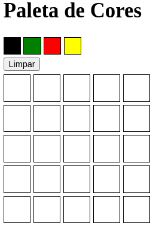
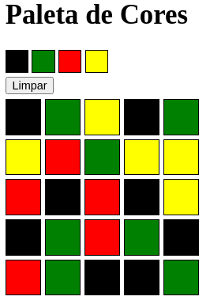

# Pixels Arts

# Habilidades

- Manipular o DOM

- Manipular o Javascript

# Como acessar

0. Certifique-se de possuir a extensão `Live Server` ou `Live Server Preview` no `VS Code` (ou outro simulador de HTML de sua preferência).

1. Clone o repositório
  * `git clone https://github.com/italosergio/pixels-art`
  * Entre na pasta do repositório que você acabou de clonar:
    * `cd pixels-art`

2. Instale as dependências e inicialize o projeto
  * Instale as dependências:
    * `npm install`
  * Inicialize o projeto:
    * `f1` > `Live Server` ou `Alt+L Alt+O`

3. Divirta-se!!!

## Screenshots

 
